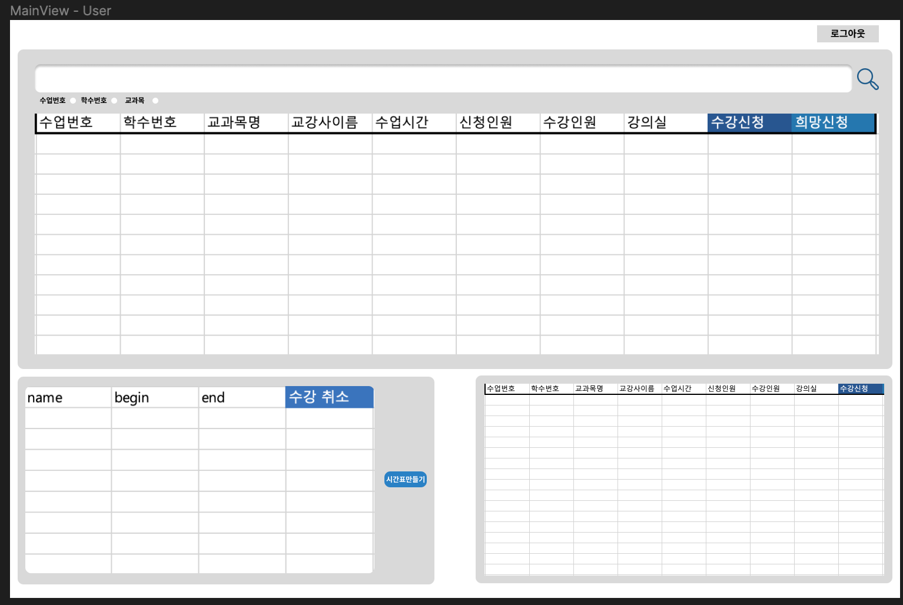

# 데이터베이스시스템 #Project1

- Database Schema
    
    
    
- Application Design


로그인 화면

아이디와 패드워드를 입력한 뒤 로그인 버튼을 누르면 아이디의 종류에 따라 관리자/사용자 화면으로 진입한다. 관리자일 경우에는 관리자 란에 체크를 하고 로그인 시도한다. 정보가 없는 경우 - 잘못된 아이디, 비밀번호 입니다 라는 팝업을 띄운다. / 같은 정보가 있는 경우 - 유형에 따라 관리자 혹은 유저 화면으로 전환



유저가 보는 메인 화면

로그아웃 버튼 - 로그아웃후 로그인뷰로 전환

검색 테이블 - 수업번호/학수번호/교과목 중에 원하는 정보를 선택해서 그 정보를 통해 수업을 검색한다. 수업에 대한 정보들을 얻을수 있으며, 해당 테이블에서 수강신청/희망신청 이 가능하다.

신청된 과목 테이블 - 내가 이미 수강 신청한 수업들에 대한 테이블을 보여준다. 시간표만들기 버튼을 누를 시 현재 신청한 과목을 기준으로 시간표를 만들어준다. 수강취소 버튼을 통해 신청한 과목을 취소할 수 있다. 

+) 희망과목 테이블 -  희망한 과목의 리스트를 보여주며 이 테이블에서도 수강신청을 할 수 있다.

+) 정보 변경 → 로그아웃 버튼 옆에 휴학/재학/퇴학 상태 변경


관리자가 보는 메인화면

로그아웃 버튼 - 로그아웃 후 로그인 뷰로 전환

검색 테이블 - 수업번호/학수번호/교과목 중에 원하는 정보를 선택해서 그 정보를 통해 수업을 검색한다. 수업에 대한 정보들을 얻을수 있으며, 해당 테이블에서 수강개설 및 삭제가 가능하다. (과목증원, 수강허용) (수정가능한 부분은 text입력칸을 두어 수정가능하게 하고 수정버튼을 누르면 수정한 부분을 저장한다)

학생 조회 테이블 - 학생을 검색하고 학생에 대한 정보들을 조회할 수 있으며 학생의 상태를 변경할 수 있다. (시간표는 버튼을 두어 누르면 시간표가 뜨게, 상태변경도 마찬가지로)

수업 추가 테이블 - 수업에 대한 정보를 입력하고 추가버튼을 누르면 수업이 추가된다.

통계 테이블 - 평점평균-과목학점 이 가장 큰 과목 TOP10 을 게시한다.

- SQL

(User)로그인 

```sql
--주어진 값 : id_from_web, password_from_web
select student_id
from student
where id_from_web=student_id and password_from_web=password
```

(Admin)로그인

```sql
--주어진 값 : id_from_web, password_from_web
select admin_id
from admin
where id_from_web=admin_id and password_from_web=password
```

수업 검색 - 수업 번호 (수업번호, 학수번호, 교과목명, 교강사이름, 수업시간, 신청인원, 수강정원, 강의실 건물, 강의실 호수, 유저면 신청버튼)

```sql
--주어진 값 : class_no_from_web
**SELECT** class_no, coure_id, name, major_id, lecturer.name, time.begin, tme.end, enrollment_table.enrollment_count, person_max, building.name, building.rooms
**FROM** class join lecturer using (lecturer_id) join time using (class_id) join room using (room_id) join building using (building_id) join (select count(*) as enrollment_count, class_id from enrollment group by class_id) as enrollment_table using (class_id)
where class_no_from_web = class_no
```

수업 검색 - 학수 번호

```sql
--주어진 값 : course_no_from_web
**SELECT** class_no, coure_id, name, major_id, lecturer.name, class_time.begin_time, tme.end_time, enrollment_table.enrollment_count, person_max, building.name, building.rooms
**FROM** class join lecturer using (lecturer_id) join class_time using (class_id) join room using (room_id) join building using (building_id) join (select count(*) as enrollment_count, class_id from enrollment group by class_id) as enrollment_table using (class_id)
where course_no_from_web = course_no
```

수업 검색 - 교과목

```sql
--주어진 값 : name_from_web
**SELECT** class_no, coure_id, name, major_id, lecturer.name, class_time.begin_time, tme.end_time, enrollment_table.enrollment_count, person_max, building.name, building.rooms
**FROM** class join lecturer using (lecturer_id) join class_time using (class_id) join room using (room_id) join building using (building_id) join (select count(*) as enrollment_count, class_id from enrollment group by class_id) as enrollment_table using (class_id)
where name like "%name_from_web%"
```

수업 시간표 생성

```sql
-- 주어진 값 : current_student_id
select begin_time, end_time
from enrollment join class_time using (class_id)
where current_student_id = student_id and begin_time not like "1900-01-06%"
```

(User) 수강 신청 - 이전 성적이 B0 이상인지? / 정원은 다 찼는지 / 시간이 겹치는지 / 최대학점에 안넘는지

```sql
-- 주어진 값 : current_student_id, class_id_to_enroll
insert into enrollment
select current_student_id, class_id, (select enrollment_id from enrollment order by enrollment_id desc limit 1) + 1 
from class join class_time
where class_id = class_id_to_enroll 
and ("B0","B+","A0","A+") not in ( select grade from credit where student_id = current_student_id and course_id = ( select course_id from class where class_id = class_id_to_enroll)) 
and person_max > ( select count(*) from enrollment where class_id = class_id_to_enroll group by class_id )
and not exist (select * from (select * from enrollment join class_time where student_id = current_student_id) as T where (begin_time between T.begin_time and T.end_time) or (end_time between T.begin_time and T.end_time))
and (select sum(credit) from enrollment join class on (student_id = current_student_id)) + credit < 19 
```

(User) 희망 강의 신청

```sql
-- 주어진 값 : current_student_id, class_id_to_enroll
insert into hope
select class_id, current_student_id, (select hope_id from hope order by hope_id desc limit 1) + 1 
from class
where class_id not in (select class_id from hope where student_id = current_student_id)
```

(Admin) 수업 설강

```sql
-- 주어진 값 : class 의 모든 attribute + class_time 의 모든 attribute
insert into class
select class_id_insert, class_no_insert, course_id_insert, name_insert, major_id_insert, class_year_insert, credit_insert, lecturer_id_insert, person_max_insert, opened_insert, room_id_insert
from DUAL
where person_max_insert > (select occupancy from room where room_id = room_id_insert) and begin_time_inset not like "1900-01-07%"

insert into class_time
select (time_id_insert, class_id_insert, period_insert, begin_time_insert, end_time_insert
from DUAL
where exist (select class_id from class where class_id = class_id_insert)
```

(Admin) 수업 폐강 → 희망, 신청 에서도 삭제

```sql
--주어진 값 : class_id_to_delete
delete class, enrollment, hope, class_time
where class_id_to_delete = class_id
```

(Admin) 수업 수정 - 과목증원, 수강허용변경

```sql
-- 주어진 값 : person_num_update, class_id_to_update
update class
set person_max = person_num_update
where class_id = class_id_to_update

-- 주어진 값 : opened_update, class_id_to_update
update class
set opened = opened_update
where class_id = class_id_to_update
```

(Admin) 학생 정보 조회 - 금학기 시간표 / 성적 / 지도교수 / 재학,휴학,자퇴

```sql
-- 금학기 시간표
-- 주어진 값 : student_id_to_search
select name, begin_time, end_time
from enrollment join class on (student_id = student_id_to_search) join class_time

-- 성적
-- 주어진 값 : student_id_to_search
select name, grade
from credit join course
where student_id = student_id_to_search

-- 지도교수
-- 주어진 값 : student_id_to_search
select lecturer.name
from student join using (lecturer_id)
where student_id = student_id_to_search

-- 재학/휴학/자퇴
-- 주어진 값 : student_id_to_search
select current_status
from student
where student_id = student_id_to_search
```

(Admin) OLAP

```sql
-- 평점 평균과 특정 과목의 학점 간 차이 ( 평점 평균 - 과목 학점 ) 이 가장 큰 탑10 뽑기
-- 전체 평균 구하고 과목평균 구하고 빼서 정렬 
with score_table as (
select course_id, case when grade = "A+" then 4.5
														 when grade = "A" then 4
														 when grade = "B+" then 3.5
														 when grade = "B" then 3
														 when grade = "C+" then 2.5
														 when grade = "C" then 2
														 else 0
														 end as [grade_to_score]
from credit)
),
avg_score_table as (
select course_id, avg(grade_to_score), (select avg(grade_to_score) from score_table) as all_avg 
from score_table
group by course_id
)

select name, abs(grade_to_score - all_avg) as diff_avg
from avg_score_table
order by diss_avg
limit 10
```


# 데이터베이스 #Project1 Milestone2

# Scema Design


# UI Design


로그인 페이지 - 입력되는 아이디의 종류에 따라 학생메인페이지/관리자 메인페이지 로 이동합니다.


학생메인 페이지 - 상단에는 다른 기능 페이지로 갈 수 있는 네비 바가 있습니다. 메인페이지에서 수업번호, 학수번호, 교과목 명을 이용해 수업을 검색 할 수 있으며 검색 결과는 하단에 표로 나타납니다. 표에는 수업에 대한 정보와 해당 수업을 신청하는 수강신청 버튼, 장바구니에 담아두는 희망 신청버튼이 존재합니다.


시간표 페이지 - 시간표 탭을 누르면 현재 수강신청을 해둔 과목에 대한 시간표를 볼 수 있습니다.


시간표 페이지 - 시간표 밑에는 현재 수강 신청한 과목들에 대한 정보를 표로 볼 수 있으며 해당 표를 통해 신청한 과목을 취소할 수 있습니다. ㅋ


희망 수업 페이지 - 해당 페이지에서는 장바구니에 담아놓은 과목에 대해 확인할 수 있습니다. 표에서 과목에 대한 정보를 볼 수 있으며 수강신청 버튼을 통해 수강신청을 진행 할 수 있습니다. 또한 장바구니에서 삭제도 가능합니다.


관리자 모드 메인 페이지 - 메인페이지의 주요기능은 수업 검색입니다. 수업을 검색할 수 있는 부분은 학생화면과 동일하지만 수강신청, 희망과목 버튼 대신 폐강버튼과 증원 버튼을 통해 수업에 대한 관리를 진행 할 수 있습니다. (증원 시 숫자만 입력할 수 있으며 기존의 정원보다 낮게 입력하는 경우는 생각하지 않았습니다.)


설강 페이지 - 수업에 대한 정보를 입력해 새로운 수업을 생성 할 수 있는 페이지 입니다. 

(중복되는 class_id, class_no 에 대해서는 고려하지 않음, 존재하지 않는 course_id, major_id, lecturer_id, room_id 에 대해서는 고려하지 않음, 시작시간과 끝나는시간이 정상적으로 입력된다는 가정, 시간 입력형식은 09:00/11:00/02:30 임, day_of_week 는 1부터 6까지 입력 가능하고 각각 월,화,수,목,금,온라인 에 해당한다.)


학생 정보 조회 페이지 - 학번을 입력 한 뒤 조회 버튼을 누르면 해당 학생에 대한 정보가 표로 나열됨. 현재 상태를 변경할 수 있는 버튼 존재


과목통계 페이지 - 모든 과목에 대해 학생들의 평균 점수에 비해 적게 준 상위 10개 강의를 표시한다.

# Schema : Input Data Set

편의성을 위해 모든 변수들을 varchar 로 저장하였다. 

enrollment (class_id, student_id, enrollment_id)

hope(class_id, student_id, hope_id)

admin(admin_id, password,name)

student(student_id, password, name, sex, major_id, lecturer_id, student_year, current_status)

lecturer(lecturer_id, name,major_id)

course(course_id, name, credit)

credit(credits_id, student_id, course_id, year, grade)

class_t(class_id, class_no, course_id, name, major_id, class_year, credit, lecturer_id, person_max, opened, room_id)

major(major_id, name)

class_time(time_id, class_id, period, begin_time, end_time, day_of_week)

building(building_id, name, admin,rooms)

room(room_id, building_id, occupancy)

# 구현된 코드 설명

- 사용된 SQL String

```sql
-- AdminDAO 
-- 아이디를 입력 받고 해당하는 id에 대한 비밀번호를 반환한다.
SELECT password FROM admin WHERE admin_id = ?
```

```sql
-- Class_tDAO
-- class_id 를 입력받고 해당하는 class 를 삭제
delete from class_t where class_id = ?

-- class 에 대한 정보를 입력받고 해당하는 class를 삽입
--  class_id,  class_no,  course_id,  name,  major_id,  class_year,  credit,  lecturer_id,  person_max,  opened,  room_id
insert into class_t value(?,?,?,?,?,?,?,?,?,?,?)

-- class_id 와 num 을 입력받아 해당하는 class의 수강인원을 업데이트 한다.
update class_t set person_max = ? where class_id = ?

-- searchType 에 따라 searchKeyword 를 이용하며 해당하는 class 를 검색한다.

-- searchType = class_no
SELECT class_no, course_id, class_t.name as class_t_name, class_t.major_id as class_t_major, lecturer.name as lecturer_name, class_time.begin_time, class_time.end_time, 
(select count(ifnull(a.enrollment_count,0)) from (select count(*) as enrollment_count from enrollment where class_id in (select class_id from class_t where class_no = ? and opened = "2022") group by class_id) as a),
person_max, building.name as building_name, building.rooms, class_id,class_time.day_of_week
FROM class_t join lecturer using (lecturer_id) join class_time using (class_id) join room using (room_id) join building using (building_id)
where class_no = ? and opened = "2022" and period = "2"

-- searchType = class_id
SELECT class_no, course_id, class_t.name as class_t_name, class_t.major_id as class_t_major, lecturer.name as lecturer_name, class_time.begin_time, class_time.end_time, 
(select count(*) as enrollment_count from enrollment where class_id in (select class_id from class_t where course_id = ? and opened = "2022") group by class_id) as enrollment_count, 
person_max, building.name as building_name, building.rooms, class_id,class_time.day_of_week
FROM class_t join lecturer using (lecturer_id) join class_time using (class_id) join room using (room_id) join building using (building_id)
where course_id = ? and opened = "2022" and period = "2"

-- searchType = name
SELECT class_no, course_id, class_t.name as class_t_name, class_t.major_id as class_t_major, lecturer.name as lecturer_name, class_time.begin_time, class_time.end_time, 
(select count(*) as enrollment_count from enrollment group by class_id limit 1) as enrollment_count, person_max, building.name as building_name, building.rooms, class_id,class_time.day_of_week
FROM class_t join lecturer using (lecturer_id) join class_time using (class_id) join room using (room_id) join building using (building_id)
where class_t.name like ? and opened = "2022" and period = "2"

-- searchType = class_id
SELECT class_no, course_id, class_t.name as class_t_name, class_t.major_id as class_t_major, lecturer.name as lecturer_name, class_time.begin_time, class_time.end_time, 
(select count(*) as enrollment_count from enrollment group by class_id having class_id = ?) as enrollment_count, person_max, building.name as building_name, building.rooms, class_id,class_time.day_of_week
FROM class_t join lecturer using (lecturer_id) join class_time using (class_id) join room using (room_id) join building using (building_id)
where class_id = ? and opened = "2022" and period = "2"

```

```sql
-- Class_TimeDAO
-- 해당 class 가 삭제 되었을 때 같이 삭제된다.
delete from class_time where class_id = ?

-- 새로운 class 가 입력되었을 때 해당하는 시간을 추가한다.
--  class_id,  period,  begin_time,  end_time,  day_of_week
insert into class_time
select (select ifnull(max(time_id),0) from class_time order by time_id desc limit 1) + 1,?,?,?,?,?

-- class_id 를 입력받고 해당하는 class 의 시간정보를 반환한다. 
select begin_time, end_time, name, day_of_week from class_time join class_t using(class_id) where class_id = ?
```

```sql
-- CreditDAO
-- 학생의 평균학점을 구하기 위해 입력받은 student_id 에 해당하는 학생의 모든 학점을 반환
SELECT credit, grade FROM credit join course using(course_id) WHERE student_id = ?

-- student_id 에 해당하는 학생이 course_id 에 해당하는 수업을 수강 했었는지 확인
select ifnull(count(*),0) from credit where student_id = ? and course_id = ?

-- OLAP 
-- ((학생1의 평균 - 과목x의 평균) + (학생2의 평균 - 과목x의 평균) ... ) 의 평균
-- ((학생1의 평균 - 과목y의 평균) + (학생2의 평균 - 과목y의 평균) ... ) 의 평균
-- 이런식으로 해서 해당 편차의 평균이 가장 큰 과목
-- score_table : 등급으로 표현되어있는걸 점수로 변환
-- course_avg : 각 수업의 평균 계산
-- student_avg : 각 학생의 평균 계산

with score_table as (
select course_id, student_id, case when grade = \"A+\" then 4.5
 when grade = \"A0\" then 4
 when grade = \"B+\" then 3.5
 when grade = \"B0\" then 3
 when grade = \"C+\" then 2.5
 when grade = \"C0\" then 2
 when grade = \"D0\" then 1
 else 0
 end as grade_to_score 
 from credit)
,
course_avg as (
 select course_id, avg(grade_to_score) as avg_grade, (select avg(grade_to_score) from score_table) as all_avg 
 from score_table 
 group by course_id
)
,
student_avg as (
 select student_id, avg(grade_to_score) as avg_score_student 
 from score_table 
 group by student_id
)
select course_id, avg(diff_avg) as result 
 from(
 select course_id, (avg_score_student-avg_grade) as diff_avg 
 from score_table join course_avg using(course_id) join student_avg using (student_id)
) as diff_t 
 group by course_id 
 order by result desc 
 limit 10

```

```sql
-- EnrollmentDAO
-- 해당 과목에 등록한 학생이 몇명인지 반환
select count(ifnull(a.class_id_count,0)) from (select count(*) as class_id_count from enrollment where class_id = ? group by class_id) as a

-- 해당 학생이 수강신청한 과목의 class_id 를 반환
select class_id from enrollment where student_id = ?

-- 해당 학생의 해당 과목 수강취소
delete from enrollment where student_id = ? and class_id = ?

-- 수강신청한 과목이 폐강 되었을 때
delete from enrollment where class_id = ?

-- 수강 신청
insert into enrollment 
select distinct ?, ?, (select ifnull(max(enrollment_id),0) from enrollment order by enrollment_id desc limit 1) + 1 " +
from class_time join class_t using (class_id) 
where class_id = ?  
and not exists (select grade from credit join class_t using(course_id) where student_id = ? and course_id =  
( select distinct course_id from class_t where class_id = ? and grade in (\"B0\",\"B+\",\"A0\",\"A+\"))) 
and person_max > ( select count(ifnull(a.class_id_count,0)) from (select count(*) as class_id_count from enrollment where class_id = ? group by class_id) as a ) 
and (select credit + (select ifnull(sum(credit),0) from enrollment join class_t using(class_id) where (student_id = ?)) from class_t join class_time using (class_id) 
where class_id = ? and period = \'2\') < 19 
and not exists ( 
select * 
from (select * from enrollment join class_time using (class_id) where student_id = ? and day_of_week in (select day_of_week from class_time 
where class_id = ? and period = \'2\') ) as T 
where ((select begin_time from class_time where class_id = ? and period = \'2\') >= T.begin_time 
and (select begin_time from class_time where class_id = ? and period = \'2\') < T.end_time) 
or ((select end_time from class_time where class_id = ? and period = \'2\') 
<= T.end_time and (select end_time from class_time where class_id = ? and period = \'2\') > T.begin_time));
```

```sql
-- HopeDAO
-- 해당하는 학생의 장바구니 목록을 반환
select class_id from hope where student_id = ?

-- 해당하는 학생에 해당하는 수업을 장바구니에 넣음
insert into hope select distinct ?, ?, (select ifnull(max(hope_id),0) from hope order by hope_id desc limit 1) + 1 
from class_t 
where not exists (select class_id from hope where class_id = ? and student_id = ?) and not exists (select class_id from enrollment where class_id = ? and student_id = ?)

-- 해당하는 과목이 폐강 되었을 때
delete from hope where class_id = ?

-- 장바구니에서 삭제
delete from hope where student_id = ? and class_id = ?
```

```sql
-- LecturerDAO
-- 해당하는 강사의 이름을 반환
select name from lecturer where lecturer_id = ?
```

```sql
-- RoomDAO
-- 해당하는 강의실의 수용인원을 반환
select occupancy from room where room_id = ?
```

```sql
-- StudentDAO
-- 해당하는 학생의 상태를 바꿈
update student set current_status = ? where student_id = ?

-- 입력받은 아이디에 대한 비밀번호를 반환
SELECT password FROM Student WHERE student_id = ?

```

SQL 구문을 제외한 코드에 대해서는 간단한 요약 설명만 진행하겠습니다. 코드에 대한 자세한 설명은 코드 내의 주석에 설명해 두었습니다.

- JAVA

각 클래스에 대한 DTO와 데이터에 접근하기 위한 로직을 담은 DAO 를 구현하였습니다.   

DB에 접속하는 Connection 설정들을 따로 Class 로 분리하여 매번 작성하는 것이 아닌 객체로 간단하게 접근하도록 변경하였습니다. 

Class_tDAO, Class_timeDAO, CreditDAO 에는 SQL 반환값을 보다 수월하게 반환하게 하기 위해 Inner Class 를 사용했습니다.

- JSP

페이지를 실제로 표현하는 jsp 파일과 Action 만을 위해 만들어진 jsp 파일로 나뉘어져 있으며 각각은 서로 GET, POST 로 데이터를 주고받으며 주어진 일을 수행합니다. 


# 빌드 과정 및 실행 과정

인텔리제이 버전 : 2021.3
MySQL 버전 : 8.0
Tomcat : 9.0.68
SDK Amazon Corretto version : 15.0.2
Connectormysql-connector-java-8.0.20


데모 영상에 사용된 아이디는 다음과 같습니다.

학생 - ID: 2019038513, PW: 1234

관리자 - ID: admin1, PW:123

기존에 주어진 data 에서 time 파일 중 PERIOD = 2, opened=2022 인 것만 수강 신청 가능하게 해두었습니다.

# 각 요구사항에 대한 실행 결과

전반적인 실행사항은 데모 영상에 담아두었습니다.

검색기능 - 수강편람 (15점)

- 수업 검색 - class_no 를 선택하고 수업번호를 입력 한 뒤 검색한다. ex)10003


- 수업 검색 - course_id 를 선택하고 학수번호를 입력 한 뒤 검색한다 ex)CIE3022


- 수업 검색 - name 을 선택하고 이름을 입력 한 뒤 검색한다 ex) 데이
    
    
    

## 공용기능

- 로그인 / 입력한 아이디의 종류에 따라 관리자 모드 또는 학생 모드로 진입


## 관리기능

### 관리자 로그인/로그아웃 (5점)


로그인 화면에서 관리자 아이디에 해당하는 정보를 입력하고 접속하면 관리자 페이지로 이동한다. (admin1, 123) / 로그인 이후 네비 바에 있는 로그아웃 버튼을 누르면 로그아웃 된다.

### 수강 개설 및 삭제 기능 (10점)

- 과목 설강 및 강의실 조건 확인


설강 페이지에서 수업 관련 데이터를 적은 뒤 등록 버튼누르기 


강의실 수용인원을 초과할경우 실패

- 과목 폐강


과목 검색 이후 폐강버튼 클릭


강의 삭제 성공 메시지


이후 검색 및 수강신청 했던 학생의 수강신청 목록에서도 사라짐 (시간표의 asd 과목 사라짐)

### 학생/과목 상태 변경 및 조회 (10점)

- 학생 조회 및 상태 변경


학생의 학번을 입력한 뒤 검색버튼을 누르면 해당 학생에 대한 정보가 나온다.

관리자는 이 기능을 통해 학생들의 시간표를 조회할 수 있다.


상태 변경 테이블에서 변경할 상태를 체크한 뒤 제출 버튼을 누른다. 이후 다시 그 학생을 검색하면 상태가 변경되어있다.

- 과목 조회 및 증원


검색 결과로 나온 과목 데이터표에서 증원 인풋값으로 현재 정원 수 보다 큰 숫자를 넣은 뒤 제출 버튼 클릭


이후 다시 검색하면 증원된 상태로 조회

### OLAP (25점)


## 수강신청 기능

### 사용자 로그인/로그아웃 (5점)


알맞은 아이디와 비밀번호 입력시 로그인 성공

### 수강신청/취소 기능


검색/장바구니 탭에서 수강신청 버튼을 눌렀을때 제한사항에 해당하지 않는다면 수강신청에 성공했다는 메시지 출력


이후 시간표/테이블 에서 신청 내역을 확인 할 수 있다.

이때 시간표 밑에 있는 테이블의 수강 취소 버튼을 통해 수강취소를 할 수 있다.


수강 삭제 완료 메시지 이후 시간표에서 확인 할 수 없는 모습

### 장바구니 기능


수강편람의 검색 결과에서 희망신청 버튼을 누르면 희망 강의에 추가하였습니다. 메시지 출력


이후 희망페이지에서 희망 삭제 버튼을 누르면 희망 강의에서 삭제되었습니다. 메시지 출력

### 시간표 생성 기능


신청한 강의에 따른 시간표를 출력해준다. 

# Trouble Shooting

웹 작성에 대한 어려움 - 처음으로 웹을 제작하는 프로젝트였는데 주어진 정보와 시간이 너무 부족하여 어려움을 겪었습니다. 초반에는 간단한 post 조차 보낼줄 몰라 구글링을 상당히 오래 했던 기억이 납니다. 나중에는 익숙해지고 같은 구조의 반복이라 수월했지만 프로젝트 작성 초반에는 정말 어려웠습니다. 구글링과 조교님이 처음에 주신 로그인 데모를 최대한 참고하여 빈약하지만 완성할수 있었던것 같습니다. 또한 완성된 웹 사이트를 보면 아시겠지만 웹사이트의 UI 마진이나 Table에서 브라우져 폭에 따른 inner text의 가독성 저하 등등 UI적인 부분에서 부족한 부분이 너무 많은것 같습니다. 구글을 통해 최대한 템플릿이나 css 를 찾아보려 하였지만 기본 기능 구현하는데에도 시간이 촉박하여 미처 적용하지 못한점이 아쉽습니다.

웹 사이트 새로고침 문제 - 수강취소, 희망삭제 등등 웹페이지 안에서 데이터를 변경한 뒤에 웹 상에서 바로 데이터가 바뀌지 않고 새로고침을 한번 해야 변경사항이 적용되는 현상을 수정하지 못하였습니다. 구글링을 통하여 `opener.location.reload()` 등등을 사용해보았지만 해결하지 못하였습니다.

허점이 많은 로직 - 사용자의 예상치 못한  입력값에 대한 대응이 부족합니다. input 값이 다양하고 또 형식이 다양한데 비해 시간이 부족하여 모든 변수에 대응하지 못하였습니다. 

모든 데이터 셋을 varchar 로 설정함 - 처음에는 입력 받는 값의 길이 가변성을 생각해서 모든 데이터의 값을 varchar 로 설정 하였는데 프로젝트를 완성해 갈때 쯤에 생각해보니 올바르지 않은 선택 같았습니다. 

실제 데이터 베이스에 primary key 를 적용하지 않음 - 로직상으로는 충분히 구현했다고 생각하지만 실제 데이터베이스 상에 적용했을때 삭제하는 부분에서 알수 없는 오류들이 계속 발생해 결국 primary key 를삭제하였습니다.