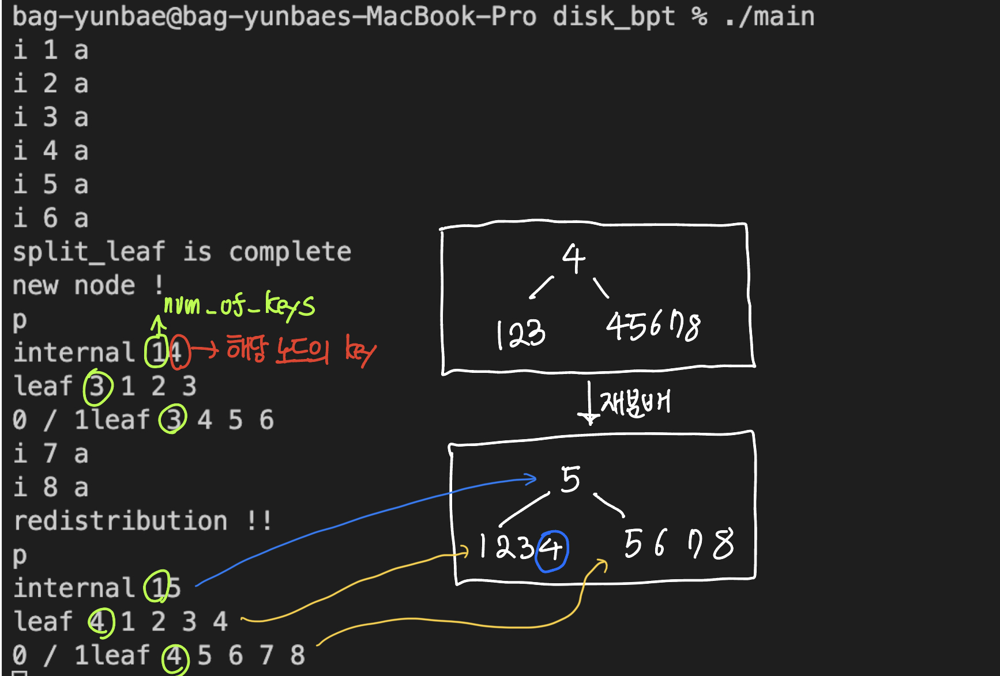

# 데이터베이스시스템 Project2 Milestone2

트리 내부 구조를 알아보기 위한 print 함수를 새로 작성하였다. command ‘p’를 입력하면 트리를 순회하며 키값들을 출력해준다.

```c
void print_tree() {
    if(rt == NULL) {
        printf("EmptyTree\n");
        return;
    }

    print_tree_start(hp->rpo);
}

void print_tree_start(off_t page_off) {
    // 출력할 페이지의 오프셋을 넘겨받고 페이지 로드
    int i=0;
    page * p;
    p = load_page(page_off);

    if(p->is_leaf) {
        // 넘겨받은 페이지가 리프라면 출력하고 끝
        printf("leaf ");
        while(i < p->num_of_keys) {
            printf("%lld ", p->records[i].key);
            i++;
        }
        printf("\n");
        return;
    } else {
        // 넘겨받은 페이지가 인터널이라면 일단 출력하고
        printf("internal "); 
        while(i < p->num_of_keys) {
                printf("%lld ", p->b_f[i].key);
                i++;
            }
            printf("\n");
    }

    // 자식 페이지에 대해서 재귀적으로 출력 다시
    int page_index = 0;
    print_tree_start(p->next_offset);
    while (page_index < p->num_of_keys)
    {
        printf("%d / %d : ", page_index, p->num_of_keys); // 현재 페이지/전체 페이지 : 
        print_tree_start(p->b_f[page_index].p_offset);
        page_index++;
    }
}
```

## Overhead 1

### Problem

인서트 키 값이 오름차순 혹은 내림차순으로 들어올 때 반대쪽 노드에 공간이 있음에도 불구하고 한쪽으로만 들어가게 된다. 이로인해 Split이 일어나는 빈도가 늘어나는 오버헤드가 발생하고 트리의 높이가 높아져 find시에 disk io가 늘어나 오버헤드가 발생한다. 

### Solution

Insert 가 일어난 이후 insert 가 일어난 페이지의 키 개수가 해당 노드의 max값과 같고 이웃 노드의 키 개수가 max보다 작을때 insert 가 일어난 페이지의 record 하나를 이웃 노드로 옮긴다. 이를 통해 인서트가 한쪽으로 편향되어도 재분배를 통해 편향된 키들을 비어있는 페이지로 옮겨주어 split의 빈도를 줄여준다. 또한 재분배를 통해 같은 수의 값을 넣더라고 트리의 높이가 낮아지게 한다. 만약 삽입/삭제보다 find 함수의 빈도가 매우 높은 구조라면 트리의 높이가 매우 중요하기 때문에 재분배로 인한 오버헤드보다 낮아진 트리의 높이로 인해 find시 얻어지는 이득이 높다고 할 수 있다. 

### Result

원활한 테스트를 위해 임시로 LEAF_MAX = 5, INTERNAL_MAX = 40 으로 임시 변경해주었습니다. 

테스트 결과를 명확하게 확인하기 위해 재분배 함수에 printf 를 임시로 추가하였으며 제출물에는 포함되지않습니다.



해당 결과를 보면 key : 8 을 넣은 이후 상황을 살펴보면. 인서트가 일어난 노드의 num_of_key 가  5로 LEAF_MAX 와 일치한다. 이웃노드의 num_of_key는 max보다 작기때문에 재분배가 일어나는 조건에 부합한다. 때문에 8이 insert 된 이후 재분배가 일어나는 모습을 볼 수 있다. 

그 수를 늘려 1부터 30까지 삽입을 한다면 기존의 비플트리와 인서트시에 재분배를 적용한 트리간의 차이는 분명하게 드러난다. (검은색 트리가 인서트시 재분배를 시행한 트리이고 녹색 트리가 재분배 없이 인서트를 한 경우이다.)


### Code

- redistribution_pages_insert

실질적으로 재분배가 이루어지는 함수이다. 

인자 (inserted_node : insert가 일어나 재분배가 필요한 노드, nbor_index : parent에서의 이웃노드의 index(-2 인 경우는 인서트가 일어난 노드가 맨 왼쪽이라 다르게 취급), nbor_off : 이웃 노드의 페이지 오프셋, par off : 부모 노드의 오프셋, k_prime : 옮겨갈 키, k_prime_index : 옮겨갈 키에 대한 부모에서의 인덱스

해당 함수는 총 4가지 경우에 따라 다르게 작동한다. (인서트된 노드가 맨 왼쪽인지 아닌지 / 인서트된 노드가 리프인지 아닌지)

1. 인서트된 노드가 맨 왼쪽이 아니고 리프노드가 아닐 때

nbor_index ≠ -2, !inserted→is_leaf 에 해당하면 조건에 만족한다. 인서트된 노드가 맨 왼쪽이 아니기 때문에 이웃노드가 해당 노드의 왼쪽 노드로 설정된다. 인서트된 노드의 맨 왼쪽 페이지 오프셋과 키를 이웃노드로 보내준다. 인서트된 노드는 한칸씩 당긴 뒤 num_of_key를 줄여준다. 이웃 노드는 맨 마지막 키 뒤에 넘겨받은 값을 추가하고 그 다음 오프셋 맨 뒤에 넘겨받은 오프셋(inserted → next_offset) 을 추가한다. 이후 옮겨진 child 를 불러 부모 노드를 수정해 준 뒤 저장한다. 마지막으로 parent의 바뀐 index에 해당하는 키값을 inserted의 변경된 첫번째 키로 수정해준다. 

1. 인서트된 노드가 맨 왼쪽이 아니고 리프노드일 때

nbor_index ≠ -2, inserted→is_leaf 에 해당하면 조건을 만족한다. 인서트된 노드가 맨 왼쪽이 아니기 때문에 이웃노드가 해당 노드의 왼쪽 노드로 설정된다. inserted의 맨 처음 record를 이웃도느의 마지막에 추가해주고, inserted의 record들을 한칸씩 당긴다. 

1. 인서트된 노드가 맨 왼쪽이고 리프노드일 때

nbor_index = -2, inserted→is_leaf 에 해당하면 조건에 만족한다. leaf 노드이기 때문에 위의 경우처럼 record만 하나 넘겨주면 되지만 해당 노드가 맨 왼쪽이기 때문에 이웃 노드가 해당 노드의 오른쪽 노드로 설정되어 있다. 때문에 inserted의 가장 마지막 record를 오른쪽 노드에 넘겨주면 된다. 오른쪽 이웃 노드는 record를 한칸씩 당기고 맨 앞에 넘겨받은 record를 추가한다. 이후 부모 노드의 키값을 수정한다. 

1. 인서트된 노드가 맨 왼쪽이고 리프노드가 아닐 때

nbor_index = -2, !inserted→is_leaf 에 해당하면 조건에 만족한다. 인서트된 노드가 맨 왼쪽이기 때문에 이웃노드가 오른쪽 노드로 설정된다. 먼저 이웃 노드의 요소들을 한칸씩 미루고 맨 앞에 인서트된 노드의 맨 마지막 요소를 넣어준다. 이후 옮겨진 노드의 부모를 이웃 노드로 변경해준다.  마지막으로 parent의 바뀐 index에 해당하는 키값을 이웃 노드의 바뀐 첫번째 키값으로 수정해준다. 

```c
void redistribution_pages_insert(off_t inserted_node, int nbor_index, off_t nbor_off, off_t par_off, int64_t k_prime, int k_prime_index) {
    // 요소가 추가되어 재분배가 필요한 노드, 이웃 노드의 순서, (-2 -1 0 1 2 ..), 이웃 노드의 offset, 부모 오프셋, 옮겨갈 숫자, 부모에서 그 숫자의 인덱스
    page *inserted, *nbor, *parent;
    int i;
    inserted = load_page(inserted_node);
    nbor = load_page(nbor_off);
    parent = load_page(par_off);

    if(nbor_index != -2) {
        // 맨 왼쪽이 아닐 때
        if(!inserted->is_leaf) {
            // leaf가 아님
            // inserted의 제일 왼쪽 key를 nbor에 넘긴다.
            // nbor의 맨 마지막 요소의 키를 k_prime 으로
            nbor->b_f[nbor->num_of_keys].key = k_prime;
            // nbor의 맨 마지막 요소의 오프셋을 inserted의 맨 앞 오프셋으로
            nbor->b_f[nbor->num_of_keys].p_offset = inserted->next_offset;
            // 해당 페이지 로드 후 부모를 이웃 노드로 수정해주고 저장
            page * child = load_page(nbor->b_f[nbor->num_of_keys].p_offset);
            child->parent_page_offset = nbor_off;
            pwrite(fd,child,sizeof(page),nbor->b_f[nbor->num_of_keys].p_offset);
            free(child);

            // 부모의 요소를 바뀐 inserted의 맨 앞껄로 바꿔줌 
            parent->b_f[k_prime_index].key = inserted->b_f[0].key; // todo 밑줄로 옮겨야 하는거 아닌가..
            // inserted의 맨 처음 오프셋을 원래 두번째 꺼 였던걸로 바꿔줌
            inserted->next_offset = inserted->b_f[0].p_offset;
            // 이후 한칸씩 땡김
            for(i=0 ; i<inserted->num_of_keys-1 ; i++) {
                inserted->b_f[i] = inserted->b_f[i+1];
            }
        } else {
            // leaf 일 때
            // inserted 의 record 한칸씩 땡기고
            nbor->records[nbor->num_of_keys] = inserted->records[0];
            for(int i=0 ; i<inserted->num_of_keys-1 ; i++) {
                inserted->records[i] = inserted->records[i+1];
            }
            parent->b_f[k_prime_index].key = inserted->records[0].key;
        }
    } else {
        if(inserted->is_leaf) {
            for(i = nbor->num_of_keys ; i>0 ; i--) {
                nbor->records[i] = nbor->records[i-1];
            }
            nbor->records[0] = inserted->records[inserted->num_of_keys - 1];
            inserted->records[inserted->num_of_keys-1].key = 0;
            parent->b_f[k_prime_index].key = inserted->records[0].key;
        } else {
            for(i = nbor->num_of_keys ; i>0 ; i--) {
                nbor->b_f[i] = nbor->b_f[i-1];
            }
            nbor->b_f[0].key = k_prime;
            nbor->b_f[0].p_offset = nbor->next_offset;
            nbor->next_offset = inserted->b_f[inserted->num_of_keys-1].p_offset;
            page * child = load_page(nbor->next_offset);
            child->parent_page_offset = nbor_off;
            pwrite(fd,child,sizeof(page),nbor->next_offset);
            free(child);
            parent->b_f[k_prime_index].key = inserted->b_f[inserted->num_of_keys-1].key;
        }
    }

    nbor->num_of_keys++;
    inserted->num_of_keys--;

    pwrite(fd,parent,sizeof(page),par_off);
    pwrite(fd,nbor,sizeof(page),nbor_off);
    pwrite(fd,inserted,sizeof(page),inserted_node);

    free(parent); free(nbor); free(inserted);
    return ;
}

off_t insert_into_leaf(off_t leaf, record inst) {

    page * p = load_page(leaf);
    //if (p->is_leaf == 0) printf("iil error : it is not leaf page\n");
    int i, insertion_point;
    insertion_point = 0;
    // 반복문 돌며 들어갈 인덱스 찾기
    while (insertion_point < p->num_of_keys && p->records[insertion_point].key < inst.key) {
        insertion_point++;
    }
    // 한칸 씩 밀어서 공간 확보
    for (i = p->num_of_keys; i > insertion_point; i--) {
        p->records[i] = p->records[i - 1];
    }
    // 넣고 사이즈 증가
    p->records[insertion_point] = inst;
    p->num_of_keys++;
    // db 에 저장
    pwrite(fd, p, sizeof(page), leaf);
    //printf("insertion %ld is complete %d, %ld\n", inst.key, p->num_of_keys, leaf);
    free(p);
    return leaf;
}
```

→ Internal node 에서 redistribution 이 일어나는 경우

해당 함수는 원래 internal node 에 insert 를 해주는 함수인데 insert 동작 이후 재분배가 필요한지 아닌지 판별해주고 필요하다면 함수를 호출해주는 역할을 한다. 먼저 해당 노드의 키의 갯수가 절반 이상일 때 이웃의 정보를 불러온다. 이웃 또한 해당 노드가 맨 왼쪽인지 아닌지에 따라 오른쪽인지 왼쪽인지 결정된다. 인서트된 노드가 맨 왼쪽이라면 이웃 노드는 오른쪽 노드가 되고 아니라면 이웃 노드는 왼쪽 노드가 된다. 이웃 노드를 특정한 이우 이웃 노드 키의 개수가 절반 이하 일때 재분배 함수를 실행시켜 준다. 

```c
off_t insert_into_internal(off_t bumo, int left_index, int64_t key, off_t newp) {

    page * parent = load_page(bumo);
    int i;
    // 부모 노드에서 들어갈 인덱스 찾기
    for (i = parent->num_of_keys; i > left_index + 1; i--) {
        parent->b_f[i] = parent->b_f[i - 1];
    }
    // 해당 인덱스에 값 넣고 write
    parent->b_f[left_index + 1].key = key;
    parent->b_f[left_index + 1].p_offset = newp;
    parent->num_of_keys++;

    if(bumo != hp->rpo) {
        if(parent->num_of_keys == INTERNAL_MAX) {
            // 삽입이 일어난 페이지의 노드 수가 맥스와 같을때
            int neighbor_index, k_prime_index;
            off_t neighbor_offset, grand_parent_offset;
            int64_t k_prime;
            grand_parent_offset = parent->parent_page_offset;
            page * grand_parent = load_page(grand_parent_offset);

            if (grand_parent->next_offset == bumo) {
                // 지워진 페이지가 children 중에서 첫번쩨 페이지 일떼?
                neighbor_index = -2;
                // 이웃은 두번째 child
                neighbor_offset = grand_parent->b_f[0].p_offset;
                // 두번째 child의 첫번째 key
                k_prime = grand_parent->b_f[0].key;
                k_prime_index = 0;
            }
            else if(grand_parent->b_f[0].p_offset == bumo) {
                // 지워진 페이지가 children 중에서 두번째 페이지 일떼?
                neighbor_index = -1;
                // 이웃 노드는 첫번재 노드
                neighbor_offset = grand_parent->next_offset;
                k_prime_index = 0;
                k_prime = grand_parent->b_f[0].key;
            }
            else {
                // 나머지
                int i;
                // 지워진 페이지에 대한 인덱스 찾기
                for (i = 0; i <= grand_parent->num_of_keys; i++)
                    if (grand_parent->b_f[i].p_offset == bumo) break;
                // 지워진 노드의 왼쪽이 이웃 노드
                neighbor_index = i - 1;
                neighbor_offset = grand_parent->b_f[i - 1].p_offset;
                k_prime_index = i;
                k_prime = grand_parent->b_f[i].key;
            }

            // 이웃 노드 불러옴
            page * neighbor = load_page(neighbor_offset);
            if(neighbor->num_of_keys < INTERNAL_MAX) {
                free(neighbor);
                free(grand_parent);
                redistribution_pages_insert(bumo,neighbor_index,neighbor_offset,grand_parent_offset,k_prime,k_prime_index);
            }
        }
    }

    pwrite(fd, parent, sizeof(page), bumo);
    free(parent);

    if (bumo == hp->rpo) {
        free(rt);
        rt = load_page(bumo);
        // 변경한 부모가 루트라면 루트를 다시 로드 한다.
    }
    return hp->rpo;
}
```

→ leaf node 에서 redistribution이  일어나는 경우

해당 함수도 기존에는 리프노드에 요소를 넣어주기만 했었는데 위와 마찬가지로 인서트가 일어난 노드의 상황에 따라 이웃 노드를 설정해주고 이웃 노드와 인서트가 일어난 노드의 남은 키 개수에 따라 재분배 함수를 실행해주는 기능을 추가하였다.  

```c
int db_insert(int64_t key, char * value) {

    record nr; //key+value
    nr.key = key;
    strcpy(nr.value, value);
    // 구조체에 입력받은 데이터 저장
    if (rt == NULL) {
        // rt == null -> 현재 읽고 있는 페이지가 없음 .. 새로운 페이지 파일 생성
        start_new_file(nr);
        return 0;
    }

    // 이미 있는건지 아닌지 체크
    char * dupcheck;
    dupcheck = db_find(key);
    if (dupcheck != NULL) {
        free(dupcheck);
        return -1;
    }
    free(dupcheck);

    // 해당하는 키가 들어갈 오프셋
    off_t leaf = find_leaf(key);

    page * leafp = load_page(leaf);

    if (leafp->num_of_keys < LEAF_MAX) {
        // 리프에 자리가 있다면 넣고 끝
        insert_into_leaf(leaf, nr);
        free(leafp);
        leafp = load_page(leaf);

        // redistribution 을 할 수 있는지 확인
        // 조건1 - 인서트가 일어난 리프의 요소 갯수가 맥스인지. 
        if(leafp->num_of_keys == LEAF_MAX && leaf!=hp->rpo) {
            // 넘는다면 이웃에 대한 정보를 불러온다. 
            int neighbor_index, k_prime_index;
            off_t neighbor_offset, parent_offset;
            int64_t k_prime;
            parent_offset = leafp->parent_page_offset;
            page * parent = load_page(parent_offset);

            // 만약에 인서트가 일어난 리프가 맨 왼쪽이라면 
            if(parent->next_offset == leaf) {
                // 이웃 인덱스 = -2
                neighbor_index = -2;
                neighbor_offset = parent->b_f[0].p_offset;
                k_prime = parent->b_f[0].key;
                k_prime_index = 0;
            }else if(parent->b_f[0].p_offset == leaf) {
                // 지워진 페이지가 children 중에서 두번째 페이지 일떼?
                neighbor_index = -1;
                // 이웃 노드는 첫번재 노드
                neighbor_offset = parent->next_offset;
                k_prime_index = 0;
                k_prime = parent->b_f[0].key;
            }
            else {
                // 나머지
                int i;
                // 지워진 페이지에 대한 인덱스 찾기
                for (i = 0; i <= parent->num_of_keys; i++)
                    if (parent->b_f[i].p_offset == leaf) break;
                // 지워진 노드의 왼쪽이 이웃 노드
                neighbor_index = i - 1;
                neighbor_offset = parent->b_f[i - 1].p_offset;
                k_prime_index = i;
                k_prime = parent->b_f[i].key;
            }

            // 이웃노드 갯수 가 맥스보다 작다면
            page * neighbor = load_page(neighbor_offset);
            
            free(neighbor);
            free(leafp);
            free(parent);

            if(neighbor->num_of_keys < LEAF_MAX) {
                redistribution_pages_insert(leaf,neighbor_index,neighbor_offset,parent_offset,k_prime,k_prime_index);
            }
            return 0;
        }
        free(leafp);
        return 0;
    } 

    // 리프에 자리가 없다면
    insert_into_leaf_as(leaf, nr);
    free(leafp);
    //why double free?
    return 0;

}
```

## Overhead 2

### Problem

delete시에 (delete가 일어난 페이지의 키의 개수 + 이웃 노드의 키의 개수)가 leaf_max 혹은 internal_max 보다 작거나 같을때 합병이 일어난다. 이 구로로 인해 합병이 일어난 이후 합병된 페이지의 키의 개수는 해당 페이지의 capacity의 최대와 동일할 것이다.  해당 노드에 인서트가 일어난다면 바로 스플릿이 일어날 가능성이 다분하다. 최악의 경우 해당 노드에서 딜리트와 인서트가 반복적으로 일어날 시에 스플릿-머지가 반복적으로 일어나 엄청난 오버헤드를 가져온다. 또한 merge 같이 구조를 변경하는 행위는 많은 양의 disk io 를 수반하기 때문에 최대한 피해야 한다. 

### Solution

find가 적게 일어난다는 가정 하에 합병이나 재분배시에 일어나는 disk io 는 데이터 베이스 성능 하락에 많은 비중을 차지할 수 있다. 이를 방지하기 위해 합병이나 재분배가 일어나는 기준을 낮추어 일반 딜리트로 최대한 버티고 더이상 감당할수 없을때 합병혹은 재분배가 일어나도록 변경한다.  기존에는 합병또는 재분배가 일어나는 기준이 삭제가 일어난 페이지의 키의 개수가 절반보다 작거나 같을때 일어났었는데 이를 맥스값의 1/4 로 조정하였다. (극단적으로 0으로 조절할 경우에는 트리의 높이가 삭제를 해도 낮아지지 않아 그 사이를 절충안으로 하였다.) 또한 기존에는 (delete가 일어난 페이지의 키의 개수 + 이웃 노드의 키의 개수)가 leaf_max 혹은 internal_max 보다 작거나 같을때 합병이 일어났는데 이 기준을 절반으로 줄여 합병이 일어나도 합병 결과물의 키의 개수가 leaf_max 혹은 internal_max이 되지 않도록 한다. 결과가 max값이 아니기 때문에 해당 노드에 인서트가 일어나도 스플릿이 일어나지 않는다. 재분배의 기준에도 추가 조건이 붙었다. 이웃노드의 키 개수보다 삭제가 일어난 노드의 키 개수가 작아야 재분배가 가능하토록 변경했다. 이로 인해 트리의 균형이 무분별한 재분배로 망가지지 않게 하였다. 

### Result

원활한 테스트를 위해 임시로 LEAF_MAX = 5, INTERNAL_MAX = 5 으로 임시 변경해주었습니다. 

테스트 결과를 명확하게 확인하기 위해 합병 함수에 printf 를 임시로 추가하였으며 제출물에는 포함되지않습니다.

기존의 코드 에서는 30을 지웠을때 키의 개수가 2개이고 이웃노드의 키의개수도 2개이기 때문에 이미 합병이 일어났어야 한다. 하지만 수정된 코드에서는 합병이 되는 기준을 낮추었기 때문에 29를 지웠을때 합병이 일어나는 모습을 볼 수 있다. 


### Code

재분배 혹은 합병을 고려하기 위한 조건이 cut(MAX)에서 한번 더 cut 한 값으로 변경되었다.

```c
// 삭제된 페이지의 남아있는 노드의 수가 1/4 이상일땐 그냥 끝
page * not_enough = load_page(deloff);
int check = not_enough->is_leaf ? cut(cut(LEAF_MAX)) : cut(cut(INTERNAL_MAX));
if (not_enough->num_of_keys > check){
  free(not_enough);
  //printf("just delete\n");
  return;
}
```

기존의 코드에서는 합병이 일어나는 조건이 (why <= max) 였지만 max 대신 cut(max)를 넣어 기준을 절반으로 줄였다.

또한 재분배가 일어나는 조건도 추가하여 이웃노드의 키의 개수가 삭제가 일어난 노드의 키의개수보다 작을때 재분배가 일어나도록 하였다. 

```c
if (why <= cut(max)) {
        // (이웃의 키 + 지운 노드의 키) <= max/2
        free(not_enough);
        free(parent);
        free(neighbor);
        coalesce_pages(deloff, neighbor_index, neighbor_offset, parent_offset, k_prime);
    }
    else if (neighbor->num_of_keys > not_enough->num_of_keys) {
        // (이웃의 키 + 지운 노드의 키) > max
        // 이웃의 키가 나보다 많을 때에만 재분배 일어남
        free(not_enough);
        free(parent);
        free(neighbor);
        redistribute_pages(deloff, neighbor_index, neighbor_offset, parent_offset, k_prime, k_prime_index);
    } else {
        free(not_enough);
        free(parent);
        free(neighbor);
    }
```

## Trouble Shooting

트리의 높이를 낮추기 위해 하는 재분배/합병 인데 이를 통해 얻어지는 이득과 이 행위 자체에서 오는 손실중에 무엇이 더 큰지 판별하지 못했다. 첫번째 오버헤드를 해결하는 과정에서는 트리의 높이를 낮추기 위해 너무 극단적으로 재분해를 하는 것이 아닌가 하는 생각이 들었다. 또한 두번째 오버헤드를 해결하는 과정에서 기준을 어디로 잡아야 최적화된 기준이 어디일지 확신하지 못했다. 기존의 1/2로 하면 머지 이후에 노드가 꽉 차있기 때문에 스플릿이 일어날 확룰이 매우 높다. 반면에 기준을 0 으로 한다면 머지와 재분배가 너무 일어나지 않아 딜리트가 일어나도 트리의 높이가 줄어들지 않는다. 절충안으로 1/4로 설정하였지만 이것이 옵티멀한 값인지 아닌지 판단하고 정한것이 아니다.